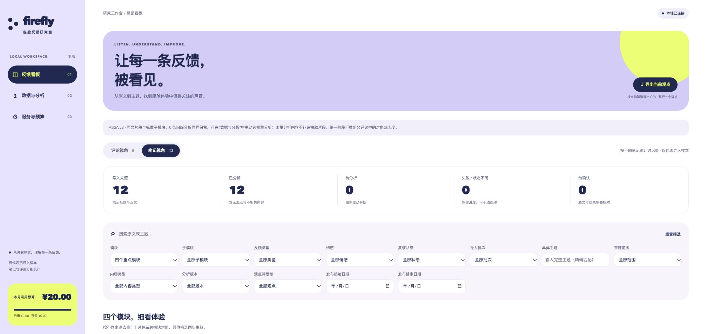
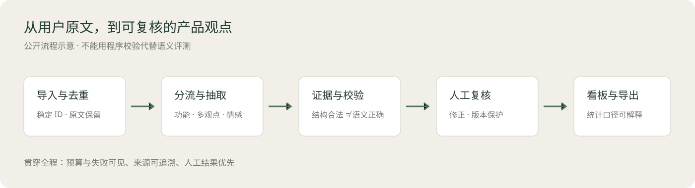
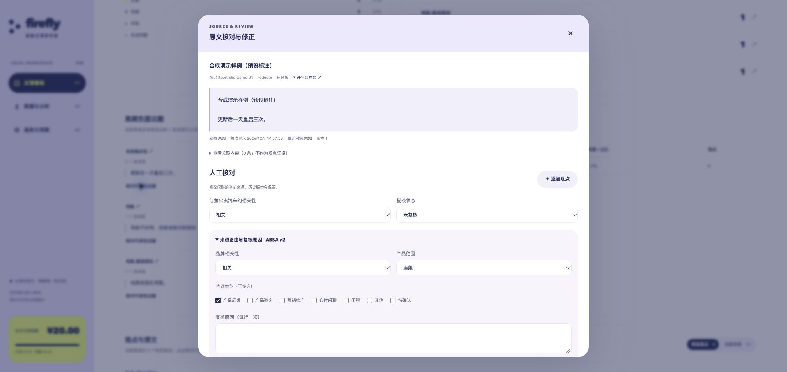

[项目展示](https://capybarra1.github.io/fy-feedback-insight/) · [GitHub 主页](https://github.com/capybarra1)

# FY 用户反馈洞察

> 将分散的产品评论整理为可追溯、可复核的功能反馈。

## 项目概览

面向车机、语音助手、辅助驾驶与智能硬件的产品反馈分析工具，覆盖内容导入、多观点抽取、人工复核、看板汇总和导出。每条观点关联具体功能和原文证据，方便产品研究人员回到用户表达，判断问题是否成立。

## 我的职责

我从座舱产品研究中的反馈整理需求出发，独立完成研究范围与标签体系设计、复核流程、分析规则和本地工具开发。开发过程中使用 AI 编程工具辅助实现，由我负责方案选择、问题定位、迭代验证与验收。

- 将研究对象拆为模块与子功能，区分有效体验反馈、内容噪音和需要进一步确认的表达。
- 设计“观点—功能—情感—原文证据”的数据结构，支持一条评论包含多个评价。
- 完成导入去重、分析、人工修正、看板与 CSV 导出的完整流程，并处理预算、并发和失败记录。

## 从评论到产品问题

导入与去重 → 内容分流 → 多观点抽取 → 原文证据校验 → 人工复核 → 模块看板与导出。

**结构示例：**“地图规划的路总是绕远，但是语音唤醒很快。”

| 观点 | 功能 | 情感 | 原文证据 |
|---|---|---|---|
| 路线规划绕远 | 车机 / 导航-路线规划 | 负面 | 地图规划的路总是绕远 |
| 语音唤醒快 | 语音助手 / 唤醒 | 正面 | 语音唤醒很快 |

把两种评价分别保留，汇总时可以同时看到导航问题与语音唤醒优势，避免整条评论被单一情感标签覆盖。

## 关键设计与迭代

**证据可追溯。** 观点必须关联当前原文中的证据，标签负责归类，原文负责核对。母笔记只用于判断品牌，不借用其中的观点。

**保留人工判断。** 分析结果可修改；人工修正过的来源不会被后续分析自动覆盖。不确定的反馈保留待复核状态，避免直接进入确定结论。

**让分析过程可管理。** 分析前提供费用预估，运行时限制并发，结束后区分成功、失败与跳过。首轮运行暴露结构失败、串行耗时和看板范围问题后，我在第二版补充了错误分类、两路受限并发、多维内容分流与离线评估入口。

## 项目交付与验证

交付了可在本地运行的分析工具、无 API 演示、分析规则、接口说明和离线评估方法。113 项 Python 检查及前端检查通过，覆盖导入、保存、证据校验、人工复核和预算等机制。

模型效果评估按有效反馈、模块、观点、证据和端到端遗漏分别统计，便于定位错误发生在哪一环节。真实模型的语义质量仍需人工标准集验收。

## 演示与运行

截图与结构示例采用合成文本及预设标注。演示服务不加载 API 配置；真实分析可配置自己的模型服务。代码与启动步骤见下方文档。

[启动说明](docs/quickstart.md) · [分析规则](docs/absa-v2.md) · [验证记录](VERIFICATION.md)
